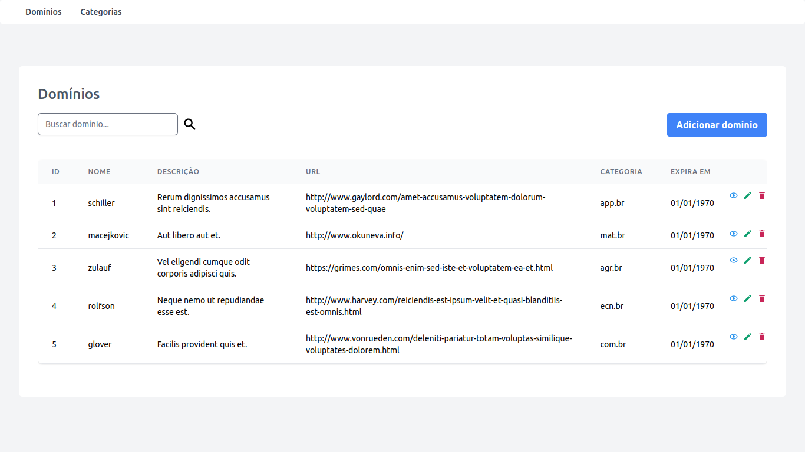

# Desafio Lumiun - Desenvolvedor PHP Larvel Júnior

[Sobre o projeto](#-sobre-o-projeto) | [Tecnologias utilizadas](#-tecnologias-utilizadas) | [Como executar o projeto](#-como-executar-o-projeto) | [Autor](#-autor) | [Licensa](#-licensa)

## Sobre o projeto

O projeto desenvolvido é uma aplicação para o gerenciamento de domínios de sites, qual é possível listar, visualizar, criar, editar e excluir domínios.

Cada domínio é único e está vinculado a uma categoria de sites.

## Tecnologias utilizadas
- [PHP 7.4.3](https://www.php.net/manual/pt_BR/)
- [Laravel 8.83.16](https://laravel.com/docs/9.x)
- [Tailwind CSS 3.1.13](https://tailwindcss.com/docs/installation)
- [MySQL](https://www.mysql.com/)

**Outras libs que também utilizei**
- [Blade UI Kit](https://blade-ui-kit.com/)
- [Flowbite](https://flowbite.com/)

## Como executar a aplicação

**Pré-requisitos**

Para executar a aplicação é necessário ter instalado em sua máquina:
- [Git](https://git-scm.com/downloads)
- [PHP](https://www.php.net/downloads.php)
- [Composer](https://getcomposer.org/download/)
- [Laravel](https://laravel.com/docs/9.x/installation)
- [MySQL](https://dev.mysql.com/downloads/installer/)
- [Node](https://nodejs.org/en/download/)
- [VSCode](https://code.visualstudio.com/download)

**Agora prossiga com os seguintes passos:**
1. Clone este repositório: 

    ```git clone [repo]```

2. Acesse a pasta ```desafio-lumiun```

3. Abra o VSCode

4. Instale as dependências do projeto, com os comandos:

    ```
    composer install
    npm install
    
    ```
**Agora vamos para a configuração do banco de dados:**

1. Crie um arquivo *.env* na raiz do seu projeto ou duplique o arquivo *.env.example*.

2. Defina os seguintes valores:

```
DB_CONNECTION=mysql
DB_HOST=127.0.0.1
DB_PORT=3306
DB_DATABASE=limiun # Crie este banco de dados no mysql primeiro
DB_USERNAME=<seu nome de usuário mysql>
DB_PASSWORD=<sua senha mysql>

```
3. Agora rode as migrations usando o comando ```php artisan migrate```.

4. Para povoar o banco de dados, utilize o script disponibilizado abaixo ou então rode as seeders.

```
php artisan db:seed
``` 
ou

<a href="./database/script.sql">
    
</a>

**Rodando a aplicação**
1. Para rodar a aplicação execute o comando ```php artisan serve``` no seu terminal.
2. Em um navegador acesse a url ```http://localhost:8000```.
3. Será exibida a tela abaixo:

    

## Autor
<a href="https://www.linkedin.com/in/anderson-fernandes96/">
    <div style="display: flex; flex-direction: column; align-items: center; gap: 10px">
    
    <strong>Anderson Fernandes Ferreira</strong>
    </div><br>
    <div style="display:flex; flex-direction:row;gap:8px;">
    <a href="https://api.whatsapp.com/send?phone=5531971046276">
        
    </a>
        <a href="https://instagram.com/anderson_ff13" target="_blank"></a>
  <a href = "mailto:andersonfferreira96@gmail.com.br"></a>
    <a href="https://www.linkedin.com/in/anderson-fernandes96/" target="_blank"></a> 
    </div>

